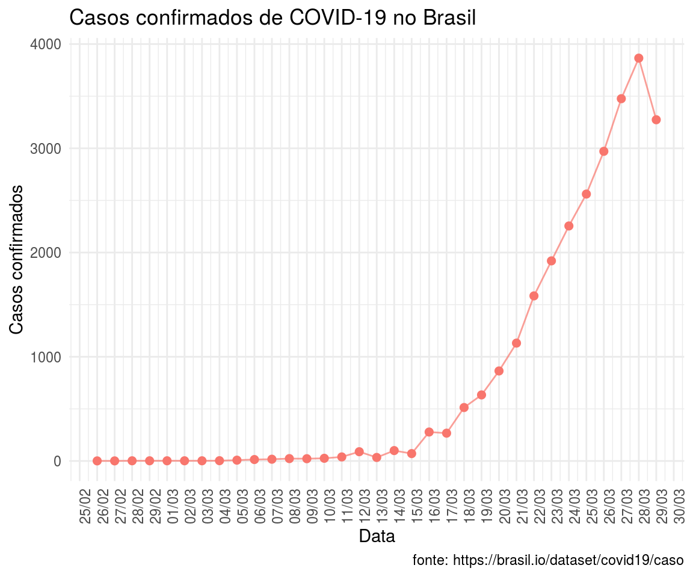
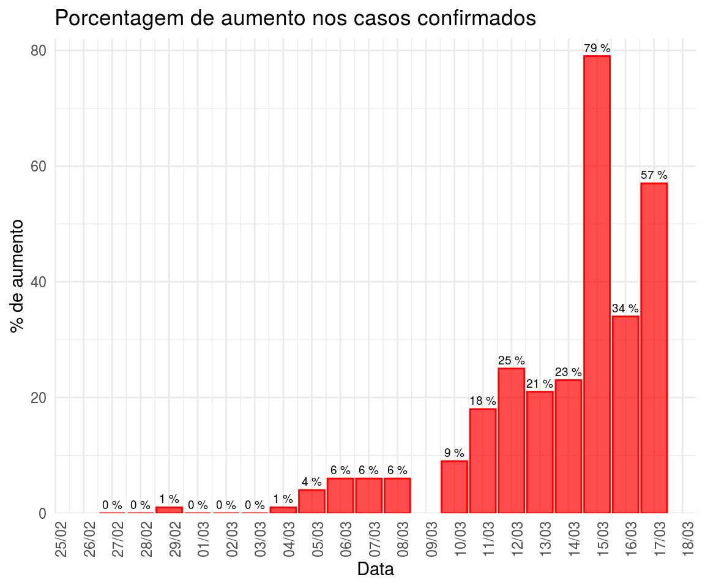
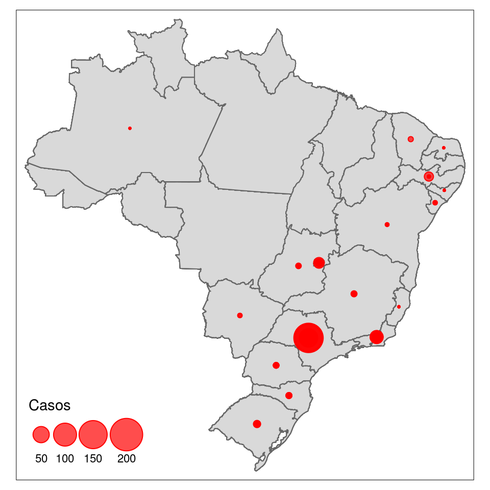
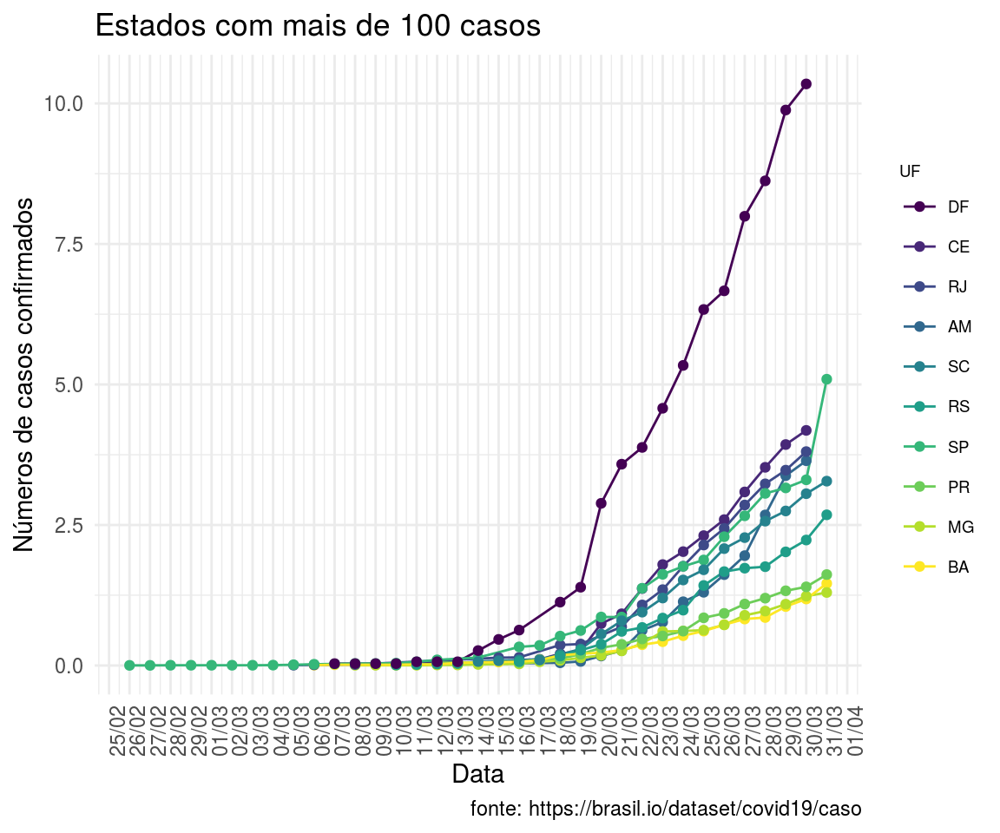
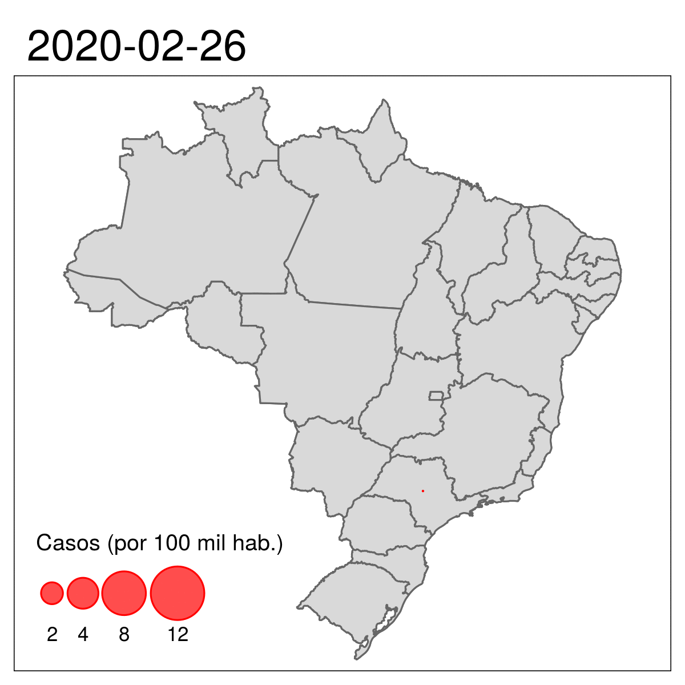

# Dados do coronavírus no Brasil 

Disponibilizamos aqui um pacote de [R](https://www.r-project.org/) para fazer o download dados dos casos diários de coronavírus (COVID-19) do Min. da Saúde disponibilizados pelo [Ministério da Saúde](http://plataforma.saude.gov.br/novocoronavirus/#COVID-19-brazil). 

Importante lembrar que os dados são apenas os casos registrados e computados pelo Min. da Saúde. 

Disponibilizamos aqui atualizações diárias dos gráficos. O código é aberto. Entre em [Get Started](https://liibre.github.io/coronabr/articles/coronabr.html) para um exemplo de como utilizar o pacote. Compartilhe. 

Fazemos ciência aberta, democrática e reprodutível. 

## Crescimento nacional no número de casos

## Entendendo o aumento diário

## Número de casos por estado brasileiro

## Crescimento do número de casos nos estados mais afetados

## Evolução do número de casos por estado

{ width=70%}

