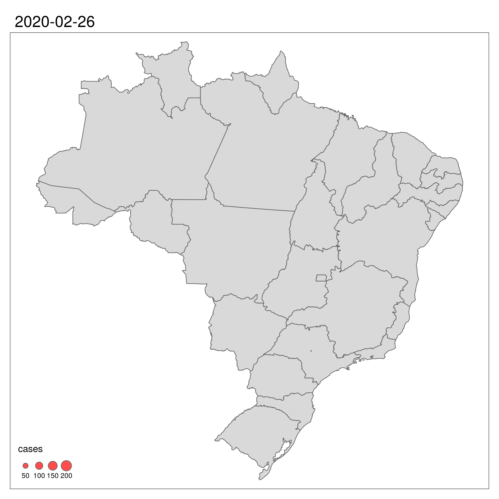

```{r setup, include = FALSE}
knitr::opts_chunk$set(echo = FALSE, message = FALSE, 
                      warning = FALSE, results = FALSE, 
                      comment = FALSE)
```

## Carregando pacotes necessários

```{r pkgs}
library(ggplot2)
library(dplyr)
library(rgdal)
library(sf)
library(tmap)
library(brazilmaps)
```


## Contabilizando os casos por dia

```{r dados, echo = TRUE}
dados <- read.csv("output/corona_brasil01.csv")
# fazendo todas as modificacoes aqui
dados <- dados %>% 
  mutate(date = as.Date(date), 
         uid = as.factor(uid)) %>%
  filter(date > '2020-02-25')
df <- dados %>% 
  select(-uid) %>%
  group_by(date, id_date) %>%
  summarise_all(sum)
```

```{r fig-casos, fig.width = 9, fig.height = 4.5}
ggplot(df, aes(x = date, y = cases)) + 
  geom_line() +
  geom_point() +
  labs(x = "Data", 
       y = "Número de casos confirmados", 
       title = "Número de casos confirmados de corona vírus no Brasil") +
  scale_x_date(date_breaks = "1 day", 
               date_labels = "%d/%m") +
  theme_minimal() +
  theme(axis.text.x = element_text(angle = 90))
```

## Entendendo o aumento diário

```{r fig-perc, fig.width = 9, fig.height = 9}
df$delta_cases <- df$cases - lag(df$cases)
df$diff_perc <- round(df$delta_cases/df$cases, 3) * 100
df$label <- paste(df$delta_cases, "%")
ggplot(df, aes(x = date, y = delta_cases)) + 
  geom_bar(stat = "identity", alpha = .7) +
  #coord_flip() 
  scale_x_date(date_breaks = "1 day", 
               date_labels = "%d/%m") +
  scale_y_continuous(limits = c(0, max(df$delta_cases, na.rm = TRUE) + 3), 
                     expand = c(0, 0)) +
  geom_text(aes(label = label), 
            size = 2.5, 
            vjust = -0.5) + 
  labs(x = "Data", 
       y = "% de aumento", 
       title = "Porcentagem de aumento nos casos confirmados") +
  theme_minimal() +
  theme(axis.text.x = element_text(angle = 90))
```

## Número de casos por estado brasileiro

```{r mapa, message = FALSE, fig.width = 6, fig.height = 6}
df_uf <- dados %>%
  filter(date == max(date)) %>%
  group_by(uid) %>%
  summarise_at(vars(cases), sum) %>%
  dplyr::rename(State = uid)

br <- get_brmap(geo = "State",
                class = "sf")

br_sf <- st_as_sf(br) %>%  
  merge(df_uf)
  
tm_shape(br_sf) +
  tm_fill() +
  tm_borders() +
  #tm_polygons() +
  #tm_shape() +
  tm_symbols(size = "cases", 
             col = "red", 
             scale = 2, 
             alpha = 0.7)
#tm_facets(by = "date", free.coords = FALSE)
```

## Evolução do número de casos por estado

```{r facet-map, fig.width = 9, fig.height = 9}
df_date <- dados %>% 
  #filter(date %in% unique(dados$date)[c(1, 10, 20)]) %>%
  group_by(uid, date) %>%
  summarise_at(vars(cases), sum) %>%
  dplyr::rename(State = uid) #%>%
  #dplyr::mutate(cases = log(cases + 1))

date_sf <- st_as_sf(br) %>%  
  merge(df_date)

all_map <- tm_shape(br) +
  tm_borders() +
  tm_polygons() +
  #br_sf %>%  merge(df_date) %>%
  tm_shape(date_sf) +
  tm_symbols(size = "cases", 
             col = "red", 
             scale = 1, 
             alpha = 0.7) +
  tm_add_legend(type = "text", 
                title = "bla", 
                labels = 'bla',
                text = 'bla') +
  tm_facets(by = "date", free.coords = FALSE)

#all_map
```


```{r anim, eval = F, fig.show = FALSE}
# anim <- tm_shape(br) +
#   tm_borders() +
#   tm_polygons() +
#   tm_shape(date_sf) +
#   tm_symbols(size = "cases", 
#              col = "red", 
#              #scale = 2, 
#              alpha = 0.7) +
#   tm_facets(along = "date", free.coords = FALSE)

# tmap_animation(anim, filename = "anim.gif", delay = 25, 
#                width = 2400, height = 2400, res = 300)

```


